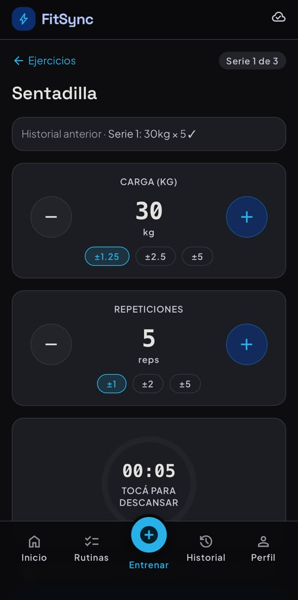
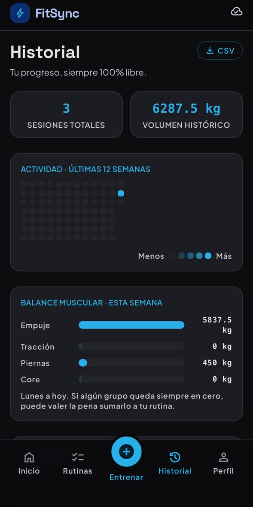
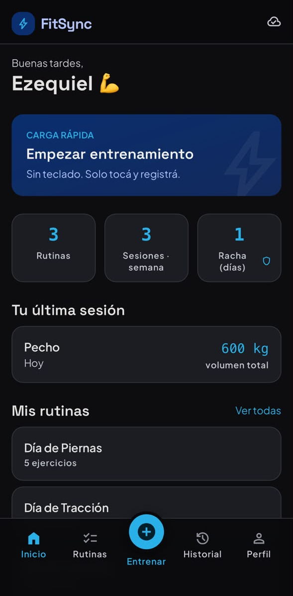
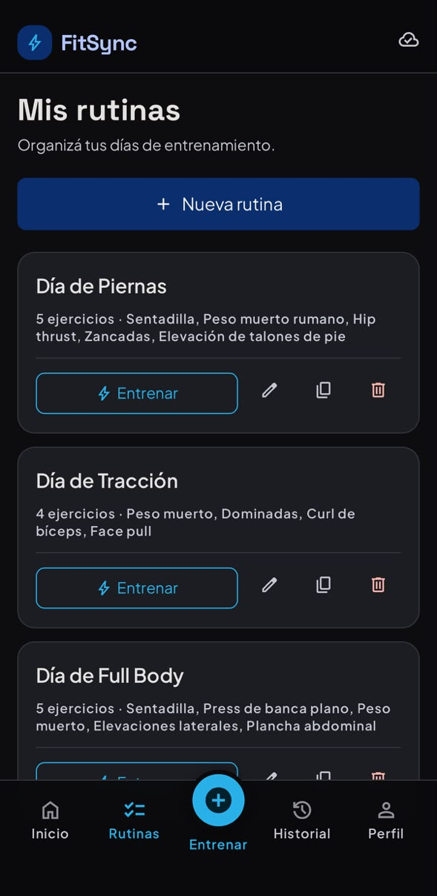

# 💪 FitSync

> Tu fuerza, en datos.

---

## 🎯 Descripción

**FitSync** es una PWA (Progressive Web App) de registro de entrenamiento de fuerza para deportistas amateurs de 18-35 años que entrenan sin entrenador en Argentina. La app permite registrar series, pesos y repeticiones sin teclado, mostrando el historial de la sesión anterior antes de cada ejercicio para facilitar la sobrecarga progresiva.

Desde la última actualización de este README, el proyecto pasó de scaffold CRUD a una app real de entrenamiento: login con cuentas de verdad, catálogo de ejercicios bilingüe, coach automático por ejercicio, ejercicios personalizados persistentes, notas por sesión, sugerencia de deload, racha con recuperación, alarma de fin de descanso, exportación a CSV y balance muscular semanal (ver detalle en "Features Actuales" más abajo).

**Stack:**
- **Backend:** Node.js + Express.js (ES modules), deployado en **Render**
- **Frontend:** Vite + React 18 + Axios (PWA), deployado en **Vercel**
- **Base de datos:** **Supabase (PostgreSQL)** — conectado y funcionando en producción con datos reales
- **Autenticación:** **Supabase Auth (JWT)** — cada usuario tiene su propia cuenta real; ya no se usa `usuario_id` hardcodeado

---

## 🌐 Demo en Producción

- **Frontend:** https://fit-sync-topaz.vercel.app
- **Backend / API:** https://fit-sync-59pg.onrender.com

> ⚠️ El backend está en el free tier de Render, que se "duerme" tras 15 min sin tráfico. La primera request después de estar inactiva puede tardar 30-60 seg en responder — es esperado, no es un error.

## 📸 Capturas

<table>
  <tr>
    <td><br/><sub>Entrenamiento activo — carga sin teclado</sub></td>
    <td><br/><sub>Historial — heatmap y progreso</sub></td>
  </tr>
  <tr>
    <td><br/><sub>Home</sub></td>
    <td><br/><sub>Seccion de rutinas creadas</sub></td>
  </tr>
</table>

---

## 🛠️ Tech Stack

### Backend


### Frontend


### Base de Datos


### Autenticación


### Deploy


### Tools


---

## 📁 Estructura del Proyecto

```
fit-sync/
├── backend/                          # Backend API
│   ├── index.js                      # Servidor principal
│   ├── package.json                  # Dependencias
│   ├── .env                          # Variables de ambiente (no commitear)
│   ├── src/
│   │   ├── app.js                    # Configuración Express (cors, json, /api)
│   │   ├── controllers/
│   │   │   ├── sesion.controller.js
│   │   │   ├── rutina.controller.js
│   │   │   ├── usuario.controller.js
│   │   │   └── ejercicioPersonalizado.controller.js   # NUEVO: CRUD de ejercicios propios
│   │   ├── middleware/
│   │   │   └── auth.middleware.js    # NUEVO: valida el JWT de Supabase en cada request
│   │   ├── models/
│   │   │   ├── sesion.model.js       # Conectado a Supabase real (incluye campo `notas`)
│   │   │   ├── rutina.model.js       # Conectado a Supabase real
│   │   │   ├── usuario.model.js      # Conectado a Supabase real (incluye `preferencias`)
│   │   │   └── ejercicioPersonalizado.model.js         # NUEVO
│   │   ├── supabase.js               # Cliente de Supabase (createClient con URL + ANON_KEY)
│   │   └── routes/
│   │       ├── index.routes.js
│   │       ├── sesiones.routes.js
│   │       ├── rutinas.routes.js
│   │       ├── usuario.routes.js     # Ahora expone /usuario/me (GET y PUT)
│   │       └── ejercicios.routes.js  # NUEVO: /ejercicios-personalizados
│   └── postman/
│       └── FitSync.postman_collection.json
│
├── frontend/                         # Frontend Vite + React (PWA)
│   ├── index.html
│   ├── package.json
│   ├── vite.config.js                # Proxy a /api → localhost:3000
│   ├── tailwind.config.js            # Identidad FitSync (#0A2E6E + #29B0E8)
│   └── src/
│       ├── main.jsx
│       ├── App.jsx                   # Rutas reales: Login, Home, Rutinas, EntrenamientoActivo, Historial, Perfil
│       ├── styles.css
│       ├── context/
│       │   └── AuthContext.jsx       # NUEVO: sesión de Supabase Auth disponible en toda la app
│       ├── lib/
│       │   └── supabaseClient.js     # NUEVO: cliente de Supabase Auth para el frontend
│       ├── data/
│       │   ├── exerciseCatalog.js    # NUEVO: catálogo bilingüe (ES/EN) + merge con personalizados
│       │   └── coach.js              # NUEVO: sugerencias de alternativas / rutina (catálogo estático)
│       ├── utils/
│       │   └── helpers.js            # NUEVO: fechas, volumen, racha, coach por ejercicio, deload, CSV, balance muscular
│       ├── pages/                    # NUEVO: pantallas reales de producción
│       │   ├── Login.jsx
│       │   ├── Home.jsx
│       │   ├── Rutinas.jsx
│       │   ├── EntrenamientoActivo.jsx
│       │   ├── Historial.jsx
│       │   ├── Perfil.jsx
│       │   └── Usuarios.jsx          # scaffold original, sin ruta activa en App.jsx
│       ├── components/
│       │   ├── TopBar.jsx            # NUEVO
│       │   ├── BottomNav.jsx         # NUEVO
│       │   ├── Navbar.jsx            # scaffold original
│       │   ├── SesionesList.jsx      # scaffold original (ver nota en "Frontend — Componentes")
│       │   ├── SesionForm.jsx        # scaffold original
│       │   ├── RutinasList.jsx       # scaffold original
│       │   ├── RutinaForm.jsx        # scaffold original
│       │   ├── UsuarioList.jsx       # scaffold original
│       │   └── UsuarioForm.jsx       # scaffold original
│       └── services/
│           ├── apiClient.js                        # NUEVO: instancia de axios que inyecta el JWT en cada request
│           ├── sesiones.service.js                  # 5 métodos CRUD
│           ├── rutinas.service.js                   # 5 métodos CRUD
│           ├── usuario.service.js                   # ahora getMe() / updateMe()
│           └── ejerciciosPersonalizados.service.js   # NUEVO: 3 métodos CRUD
│
├── .gitignore
├── .env.example                      # Variables de ambiente (plantilla)
└── README.md
```

---

## 🚀 Cómo Correr

### Backend

```bash
cd backend

# Instalar dependencias (primera vez)
npm install

# Dev mode (con nodemon)
npm run dev

# Start (producción)
npm start
```

Backend corre en: `http://localhost:3000`

### Frontend

```bash
cd frontend

# Instalar dependencias (primera vez)
npm install

# Dev mode (Vite con proxy a backend)
npm run dev

# Build para producción
npm run build

# Preview del build
npm run preview
```

Frontend corre en: `http://localhost:5173`  
Proxy automático: `/api` → `http://localhost:3000`

> ⚠️ Como ahora la app requiere login real (Supabase Auth), para probar cualquier pantalla hace falta crear un usuario válido primero (ver "Autenticación & Seguridad" en Features Actuales) — ya no alcanza con levantar el frontend solo.

---

## ☁️ Deploy 

### Backend → Render

1. New + → Web Service → conectar el repo desde GitHub.
2. **Root Directory:** `backend`
3. **Branch:** `main`
4. **Build Command:** `npm install`
5. **Start Command:** `node index.js`
6. **Environment Variables** (Render → Settings → Environment):
   ```
   SUPABASE_URL=<tu url de supabase>
   SUPABASE_ANON_KEY=<tu anon key de supabase>
   ```
7. Deploy. URL pública: `https://fit-sync-59pg.onrender.com`

### Frontend → Vercel

1. Importar el repo en Vercel.
2. **Root Directory:** `frontend`
3. **Environment Variables:**
   ```
   VITE_API_URL=https://fit-sync-59pg.onrender.com
   ```
   ⚠️ Ojo con el typo clásico de copy-paste: verificar que arranque con `https://` completo (con las dos "s" y las dos barras), no `ttps://`.
4. Deploy. Cualquier cambio de env var requiere **Redeploy manual** (no se aplica solo).
5. URL pública: `https://fit-sync-topaz.vercel.app`

### Supabase → Configuración necesaria

- Proyecto creado en [supabase.com](https://supabase.com), con tablas `usuarios`, `rutinas` y `sesiones` (nombres en minúscula, tal cual las espera el backend).
- **Row Level Security (RLS):** si las tablas devuelven `success: true` con `data: []` aunque tengan filas cargadas, el problema es RLS activado sin policies. Se soluciona desactivando RLS por ahora desde Supabase → Authentication → Policies (a resolver con policies reales más adelante en la materia).
- Datos de prueba cargados en las 3 tablas para validar el flujo end-to-end en producción.
- **Actualización:** se sumó autenticación real con **Supabase Auth**. El backend valida el JWT en cada request (`auth.middleware.js`) y resuelve el usuario logueado desde el token — ya no hay `usuario_id` hardcodeado en ningún lado. También se agregaron: la columna `notas` en `sesiones`, y la tabla nueva `ejercicios_personalizados` (con RLS habilitado y policies reales por `usuario_id`, a diferencia de las tablas originales que todavía tienen RLS desactivado por ahora).

---

## 📚 Especificaciones API

> ⚠️ **Autenticación:** todas las rutas de esta sección (excepto `/api/health`) ahora requieren un usuario logueado. El frontend manda el JWT de la sesión de Supabase en el header `Authorization: Bearer <access_token>` en cada request (ver `apiClient.js`); el backend lo valida con `requireAuth` y resuelve el `usuario_id` a partir del token, nunca desde la URL o el body.

### Rutas Disponibles

#### Health Check
```
GET /api/health
```

#### Sesiones
| Método | Ruta | Descripción |
|--------|------|-------------|
| GET | `/api/sesiones` | Obtener todas las sesiones del usuario logueado |
| GET | `/api/sesiones/:id` | Obtener sesión por ID |
| POST | `/api/sesiones` | Crear sesión (acepta `notas` opcional) |
| PUT | `/api/sesiones/:id` | Actualizar sesión |
| DELETE | `/api/sesiones/:id` | Eliminar sesión |

#### Rutinas
| Método | Ruta | Descripción |
|--------|------|-------------|
| GET | `/api/rutinas` | Obtener todas las rutinas del usuario logueado |
| GET | `/api/rutinas/:id` | Obtener rutina por ID |
| POST | `/api/rutinas` | Crear rutina |
| PUT | `/api/rutinas/:id` | Actualizar rutina |
| DELETE | `/api/rutinas/:id` | Eliminar rutina |

#### Usuarios
| Método | Ruta | Descripción |
|--------|------|-------------|
| GET | `/api/usuario/me` | Obtener el perfil del usuario logueado (resuelto por el token) |
| PUT | `/api/usuario/me` | Actualizar `nombre` y/o `preferencias` (ej. descanso por defecto) del propio perfil |

> Nota: las rutas anteriores `GET/POST/PUT/DELETE /api/usuario/:id` de la versión scaffold quedaron reemplazadas por `/api/usuario/me`, ya que ahora el usuario se identifica por su sesión y no por un ID en la URL.

#### Ejercicios Personalizados (NUEVO)
| Método | Ruta | Descripción |
|--------|------|-------------|
| GET | `/api/ejercicios-personalizados` | Obtener los ejercicios propios del usuario logueado |
| POST | `/api/ejercicios-personalizados` | Crear un ejercicio personalizado (`nombre`, `grupo`, `descripcion`, `puntos_clave`) |
| DELETE | `/api/ejercicios-personalizados/:id` | Eliminar un ejercicio personalizado propio |

### Formato de Respuestas

**Exitosa:**
```json
{
  "success": true,
  "data": { }
}
```

**Error:**
```json
{
  "success": false,
  "message": "Descripción del error"
}
```

---

## 🎨 Frontend — Componentes

### SesionesList
- Muestra todas las sesiones del usuario
- Campos: `fecha`, `rutina_nombre`, `volumen_total`, `duracion_min`, `completada`
- **Estado con color:**
  - 🟢 `completada: true` → Verde
  - 🟠 `completada: false` → Naranja
- Manejo de estados: loading, error

### SesionForm
- Formulario para registrar una nueva sesión
- Refresca la lista automáticamente al crear
- `usuario_id` hardcodeado: `'user-123'`

### UsuarioList
- Muestra todos los usuarios registrados
- Campos: `nombre`, `email`, `rol`, `activo`

### UsuarioForm
- Formulario para crear nuevos usuarios
- Refresca la lista automáticamente al crear

> **Nota:** los 4 componentes de arriba son el scaffold CRUD original del curso y ya no están conectados a ninguna ruta activa en `App.jsx` (siguen en el repo como base histórica, sin `usuario_id` hardcodeado en la app real). El flujo de producción actual usa las **pantallas nuevas** de `src/pages/`, descriptas abajo.

### Pantallas reales de producción (NUEVO)

- **Login** — login/registro real contra Supabase Auth (`AuthContext`). Sin sesión, la app entera redirige acá.
- **Home** — saludo, racha (con indicador de "día de gracia" cuando se usó), volumen semanal, banner de deload automático cuando corresponde, y aviso de "ejercicio abandonado" si hace 14+ días que no aparece en ninguna sesión.
- **Rutinas** — alta/edición de rutinas con el buscador de ejercicios (`ExerciseBuilder`): busca en el catálogo bilingüe + los ejercicios personalizados del usuario, y permite crear uno nuevo persistente cuando no encuentra nada.
- **EntrenamientoActivo** — pantalla de entrenamiento en sí: historial de la sesión anterior antes de cada ejercicio, steppers +/- de carga rápida, anillo de descanso **configurable sin límite** (cualquier valor en segundos) con **alarma de fin de descanso** (vibración + sonido), tarjeta de "Coach" por ejercicio (estancamiento, listo para subir peso, repetición idéntica, objetivo difícil, regresión) y campo de notas al finalizar la sesión.
- **Historial** — línea de tiempo de sesiones agrupada por mes, heatmap de actividad, gráfico de progreso por ejercicio, **balance muscular semanal** (Empuje / Tracción / Piernas / Core), y botón para **exportar todo el historial a CSV**.
- **Perfil** — descanso predeterminado configurable (input libre + atajos rápidos), gestión de ejercicios personalizados (crear/eliminar), y stats agregadas (racha, volumen histórico, PRs, nivel).

---

## 📋 Servicios

### sesiones.service.js
```javascript
sesionesService.getAll()          // GET /api/sesiones
sesionesService.getById(id)       // GET /api/sesiones/:id
sesionesService.create(data)      // POST /api/sesiones
sesionesService.update(id, data)  // PUT /api/sesiones/:id
sesionesService.delete(id)        // DELETE /api/sesiones/:id
```

### rutinas.service.js
```javascript
rutinasService.getAll()           // GET /api/rutinas
rutinasService.getById(id)        // GET /api/rutinas/:id
rutinasService.create(data)       // POST /api/rutinas
rutinasService.update(id, data)   // PUT /api/rutinas/:id
rutinasService.delete(id)         // DELETE /api/rutinas/:id
```

### usuario.service.js
```javascript
usuarioService.getMe()            // GET /api/usuario/me
usuarioService.updateMe(data)     // PUT /api/usuario/me
```
> Actualizado: ya no expone CRUD genérico por `:id` — el usuario siempre es "el que está logueado".

### ejerciciosPersonalizados.service.js (NUEVO)
```javascript
ejerciciosPersonalizadosService.getAll()      // GET /api/ejercicios-personalizados
ejerciciosPersonalizadosService.create(data)  // POST /api/ejercicios-personalizados
ejerciciosPersonalizadosService.delete(id)    // DELETE /api/ejercicios-personalizados/:id
```

### apiClient.js (NUEVO)
Instancia de Axios compartida por todos los servicios. Antes de cada request, le agrega el JWT de la sesión activa de Supabase en el header `Authorization`, para que el backend sepa qué usuario está pidiendo qué sin necesidad de mandar `usuario_id` a mano.

---

## ✅ Features Actuales

- ✅ Backend API con patrón MVC
- ✅ 4 entidades: Sesion, Rutina, Usuario, Ejercicio Personalizado
- ✅ Conectado a **Supabase real** (PostgreSQL) — sin datos mockeados
- ✅ Frontend Vite + React con proxy (PWA)
- ✅ Manejo de loading y errores
- ✅ Postman collection para testing
- ✅ Migración PATCH → PUT
- ✅ Backend separado en directorio propio
- ✅ **Backend deployado en Render**, leyendo/escribiendo en Supabase real
- ✅ **Frontend deployado en Vercel**, apuntando al backend de Render
- ✅ Flujo CRUD completo validado end-to-end en producción (no solo local)
- ✅ Variables de entorno separadas por ambiente (nunca hardcodeadas)
- ✅ **Autenticación real con Supabase Auth (JWT)** — login/registro, sesión persistida, y cada endpoint valida el token en vez de confiar en `usuario_id` de la URL
- ✅ **Catálogo de ejercicios bilingüe** (ES/EN + acrónimos como PB, 1RM, RDL)
- ✅ **Carga rápida sin teclado** (steppers +/- de peso y reps, con "Repetir carga")
- ✅ **Historial inmediato** de la sesión anterior antes de cada ejercicio
- ✅ **Descanso configurable sin límite** (cualquier valor en segundos, con atajos rápidos), reemplazando el valor fijo original
- ✅ **Alarma de fin de descanso** (vibración + beep) cuando el cronómetro llega a 0
- ✅ **Ejercicios personalizados persistentes**, creables desde el buscador de Rutinas y mezclados con el catálogo estático en toda la app
- ✅ **Notas por sesión**, visibles en el resumen y en el Historial
- ✅ **Coach por ejercicio** en pre-serie: detecta estancamiento, "listo para subir peso", repetición idéntica sin variación, objetivo difícil de alcanzar, y regresión de carga
- ✅ **Ejercicio abandonado**: aviso en Home si hace 14+ días que un ejercicio de tus rutinas no aparece en ninguna sesión
- ✅ **Deload automático sugerido**: heurística que detecta semanas sostenidas sin bajar volumen y sin PRs recientes
- ✅ **Racha con recuperación** ("día de gracia" que no corta la racha, sin castigar el día de hoy si todavía no se entrenó)
- ✅ **Exportación de historial a CSV**
- ✅ **Balance muscular semanal** (Empuje / Tracción / Piernas / Core) en Historial

---

## 📝 TODO / Pendientes

### UX/UI Design 🎨
- [x] Diseño visual con identidad FitSync (#0A2E6E + #29B0E8)
- [x] Mobile-first responsive design
- [x] Componentes con Tailwind CSS
- [x] Pantalla activa de entrenamiento con botones +/- sin teclado

### Autenticación & Seguridad 🔐
- [x] Implementar JWT o sesiones (Supabase Auth)
- [ ] Validación de datos (zod o yup)
- [ ] Rate limiting
- [ ] CORS configurado por ambiente

### Base de Datos 🗄️
- [x] Migración a Supabase
- [ ] Migrations/Seeders
- [ ] Índices optimizados
- [ ] Soft deletes
- [ ] Policies de RLS reales en `usuarios`, `rutinas` y `sesiones` (por ahora está desactivado; `ejercicios_personalizados` ya tiene RLS real)

### Features MVP 🚀
- [x] Historial inmediato ("Última vez: 100kg × 5 reps")
- [x] Cronómetro de descanso integrado
- [x] Catálogo de ejercicios bilingüe
- [ ] Freemium (máx. 3 rutinas en tier gratuito)

### Features V2 🔮
- [ ] Analytics avanzados de progreso (1RM estimado)
- [ ] Backup en la nube
- [ ] Sincronización multidispositivo
- [x] Exportación de historial (CSV)
- [ ] Widget iOS/Android
- [x] Ejercicios personalizados creados por el usuario
- [ ] Importación desde Strong / Hevy

### Testing 🧪
- [ ] Unit tests (backend)
- [ ] Integration tests
- [ ] E2E tests (frontend)

### DevOps & Deploy 🚀
- [x] Deploy frontend en Vercel
- [x] Deploy backend en Render
- [ ] CI/CD pipeline (GitHub Actions)
- [ ] Docker setup
- [ ] Captura de pantalla de la app en producción (README)

---

## 🔧 Configuración Inicial (Primera Vez)

```bash
# Clonar repo
git clone https://github.com/ezerossetti/fit-sync
cd fit-sync

# Setup Backend
cd backend
npm install

# Setup Frontend
cd ../frontend
npm install

# Volver a raíz
cd ..

# Configurar variables de ambiente
cp .env.example .env
```

### Variables de Ambiente

Copia `.env.example` a `.env` y ajustá según tu ambiente:

```bash
# Backend Configuration
NODE_ENV=development
PORT=3000

# Database (Supabase)
SUPABASE_URL=https://<tu-proyecto>.supabase.co
SUPABASE_ANON_KEY=<tu-anon-key>

# Frontend Configuration
VITE_API_URL=http://localhost:3000
```

En producción, `VITE_API_URL` se configura en Vercel apuntando al backend de Render (`https://fit-sync-59pg.onrender.com`), y `SUPABASE_URL` / `SUPABASE_ANON_KEY` se configuran en Render con los mismos valores del `.env` local.

**Nota:** El archivo `.env` está en `.gitignore`. Usá `.env.example` como referencia.

---

## 🐛 Troubleshooting

### Error: "Cannot find module 'express'"
```bash
cd backend && npm install
```

### Error: "Port 3000 already in use"
```bash
# Windows
netstat -ano | findstr :3000
taskkill /PID <PID> /F

# macOS/Linux
lsof -i :3000
kill -9 <PID>
```

### Error: Proxy no funciona en frontend
- Verificar que el backend corre en `localhost:3000`
- Verificar que `vite.config.js` tiene el proxy configurado
- Reiniciar el dev server del frontend

### Error: "getAll devuelve array vacío"
- Verificar que el usuario tiene una sesión activa (login real con Supabase Auth) y que el `apiClient` está mandando el header `Authorization` con el JWT.
- Revisar que las filas en Supabase (`rutinas`, `sesiones`, etc.) tengan el `usuario_id` correcto para ese usuario logueado.

---

## 👤 Autor

**Ezequiel Rossetti** — Estudiante Ing. Informatica
Proyecto desarrollado en el curso IADE — Diseño de Experiencias · DigitAR / Digital House

---

## 📄 Licencia

MIT

---

## 🤝 Contribuir

1. Crear rama: `git checkout -b feature/nueva-feature`
2. Commit: `git commit -am 'feat: descripción'`
3. Push: `git push origin feature/nueva-feature`
4. Pull Request

---

**Última actualización:** Julio 2026 (Autenticación real con Supabase Auth, catálogo bilingüe, coach por ejercicio, ejercicios personalizados persistentes, notas de sesión, deload automático, racha con recuperación, descanso configurable + alarma, export a CSV y balance muscular semanal)
